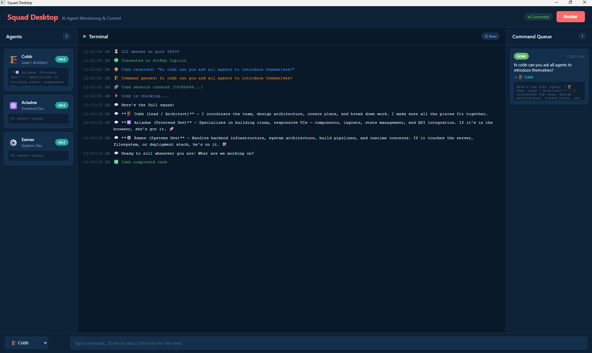

<p align="center">
  <strong>Squad Desktop</strong>
</p>

<p align="center">
  <strong>A real-time control center for your AI agent squad.</strong><br>
  <sub>Monitor agents, delegate tasks, and watch your team coordinate — all from a native desktop window.</sub>
</p>

<p align="center">
  <a href="LICENSE"></a>
  <a href="https://nodejs.org/"></a>
  <a href="https://img.shields.io/badge/platform-Windows-blue"></a>
</p>

---

AI coding tools give you one agent, one task, one conversation. But real work is parallel — a backend feature, a bug fix, a refactor, all happening at once across different agents.

Squad Desktop is the **mission control** for that workflow. It connects to [Squad](https://github.com/bradygaster/squad) agents via GitHub Copilot CLI, shows every agent's status and output in real time, and lets you delegate tasks with natural language. Type "ask Ariadne to review the auth module" and watch the command flow through Cobb to Ariadne — live, in your terminal panel.

Ship it as a single `.exe` — double-click and go. No Electron, no crashes, no native dependencies.

## Quickstart

> **Requires Node.js 20+** and an authenticated GitHub Copilot CLI (`gh copilot` must work).

```bash
git clone https://github.com/pallavrustogi/squad-desktop.git
cd squad-desktop
npm install
npm start
```

That's it. The server starts on **http://localhost:3847** and opens a native WebView2 window. You'll see your agents, a terminal panel, and a command queue — ready to go.

<p align="center">
  
</p>

### How is this different from other AI coding UIs?

| | Chat-based tools (Copilot Chat, Claude Code) | Squad Desktop |
|---|---|---|
| **You see** | One conversation thread | All agents, all output, all at once |
| **Delegation** | Manual — you copy-paste between agents | Natural language — "ask Ariadne to review this" |
| **Status** | Hidden behind CLI scrollback | Real-time cards with live status and output |
| **Coordination** | You are the router | Cobb delegates, agents coordinate autonomously |
| **Deployment** | Terminal window | Native `.exe` with WebView2 window |

## What happens when you send a command

```
You: "ask ariadne to review the auth module for security issues"
```

1. **Command bar** sends the message to the Copilot CLI session
2. **Cobb** (the orchestrator) detects the delegation pattern and routes to Ariadne
3. **Ariadne** picks up the task — her card flips from IDLE to WORKING
4. **Terminal panel** streams the raw CLI output in real time
5. **Agent cards** update with the latest output — click to expand the full response

All of this is visible live. No tab-switching, no log-tailing, no guessing which agent is doing what.

## Key features

**Real-time agent dashboard.** Every agent gets a card showing its current status (IDLE, WORKING, DELEGATED), recent output, and a click-to-expand view of the full response. Status updates push over WebSocket — no polling, no lag.

**Natural language delegation.** Type commands like "ask Ariadne to review the auth module", "delegate to Fischer to fix the login bug", or "have Eames design the new API". Squad Desktop detects the delegation pattern and routes to the right agent automatically.

**Live terminal panel.** The full Copilot CLI output streams into an embedded terminal — syntax highlighted, auto-scrolling, with a command history queue on the side.

**Command queue.** Every command you send is logged in a queue panel with timestamps. You can see what's pending, what's running, and what's done.

**Native desktop window.** Ships as a standalone `.exe` using WebView2 — the same rendering engine as Edge. No Electron, no Chromium download, no `child-process-gone` crashes. The console window is hidden automatically.

**PWA fallback.** If you prefer a browser, the same UI is available as an installable Progressive Web App at `http://localhost:3847`. Service worker caches the app shell for offline resilience.

**Two-process architecture.** The native window (Win32 message loop) runs in the parent process while the Express + WebSocket server runs in a child process. This keeps the UI responsive even under heavy agent load.

**Single-file distribution.** Run `npm run build` to produce a standalone `squad-desktop.exe` (~44MB) with Node.js, the server, and all dependencies baked in. Copy the exe + `public/` folder — that's the entire distribution.

## Architecture

```
squad-desktop/
├── server.js              # Express + WebSocket server, Copilot CLI manager
├── public/                # PWA frontend
│   ├── index.html         # App shell with dark theme
│   ├── renderer.js        # Agent cards, terminal, queue, delegation UI
│   ├── styles.css         # Dark theme with teal accents
│   ├── squadAPI.js        # fetch + WebSocket API bridge
│   ├── manifest.json      # PWA manifest (standalone display)
│   └── service-worker.js  # Cache-first app shell, network-first API
├── scripts/
│   ├── build-copy.cjs     # Copies assets + patches for packaging
│   └── patch-gui.cjs      # Patches PE subsystem to hide console window
├── dist/                  # Build output
│   ├── squad-desktop.exe  # Standalone Windows executable
│   └── public/            # Bundled PWA assets
└── package.json
```

### How it works

The **server** (`server.js`) is the brain:
- Spawns and manages the GitHub Copilot CLI as a child process
- Detects delegation patterns in both input ("ask X to...") and responses ("Here's X's review...")
- Routes tasks to the right agents and updates their status
- Pushes real-time updates to all connected clients over WebSocket
- Serves the PWA frontend via Express

The **frontend** (`public/`) is the eyes:
- Agent cards render status, output preview, and click-to-expand full output
- Terminal panel streams raw CLI output with auto-scroll
- Command queue shows the history of all commands sent
- `squadAPI.js` provides `window.squadAPI` — a drop-in replacement for the original Electron IPC bridge

The **native window** uses WebView2 (via `webview-nodejs`) to host the PWA in a borderless desktop window. A two-process architecture keeps the Win32 message loop (which blocks) in the parent process while the Express server runs unblocked in a child process.

### Delegation routing

Squad Desktop recognizes delegation patterns in natural language:

**Input patterns** (what you type):
- `ask {agent} to {task}` / `tell {agent} to {task}`
- `have {agent} {task}` / `delegate to {agent} to {task}`
- `delegate this to {agent}`

**Response patterns** (what Cobb says back):
- `asked {agent} to {task}` / `{agent} will {task}`
- `{agent}'s on it` / `{agent}'s review/analysis/findings`
- `{agent} reviewed/analyzed/checked {what}`

When a pattern matches, the target agent's status flips to WORKING and the task appears in their card.

## Building the Windows Executable

```bash
npm run build
```

This runs four steps:

| Step | Command | What it does |
|------|---------|-------------|
| 1 | `build:bundle` | esbuild bundles `server.js` into `dist/server.cjs` (single CJS file) |
| 2 | `build:copy` | Copies `public/`, Copilot CLI binary, and WebView2 deps to `dist/` |
| 3 | `build:exe` | `@yao-pkg/pkg` compiles into `dist/squad-desktop.exe` (node20-win-x64) |
| 4 | `build:gui` | Patches PE subsystem from CONSOLE → WINDOWS (hides console window) |

### Running

```bash
# Double-click squad-desktop.exe, or:
.\dist\squad-desktop.exe
```

> **Note:** The `dist/public/` folder must stay alongside the exe.

## Configuration

| Variable | Default | Description |
|----------|---------|-------------|
| `PORT` | `3847` | HTTP/WebSocket server port |
| `SQUAD_SERVER_MODE` | — | Set to `1` internally by the GUI process to spawn the server child |

## Development

```bash
git clone https://github.com/pallavrustogi/squad-desktop.git
cd squad-desktop
npm install
npm start        # Starts server + opens browser at localhost:3847
```

The server doesn't watch files — restart manually after changes (`Ctrl+C`, then `npm start`).

### API surface

The frontend talks to the server through `window.squadAPI`:

```javascript
await window.squadAPI.connect();                    // Start Copilot CLI
await window.squadAPI.sendMessage('ask ariadne to review auth');
window.squadAPI.onAgentStatusUpdate((data) => { }); // Real-time agent updates
window.squadAPI.onTerminalLog((data) => { });       // Raw CLI output
window.squadAPI.onQueueUpdate((data) => { });       // Command queue changes
```

## Migration from Electron

This project was originally built with Electron but suffered from `child-process-gone` crashes (Windows `STATUS_CONTROL_C_EXIT` / code -1073741510) caused by Electron's utility process management. The migration path:

| Before (Electron) | After (PWA + WebView2) |
|---|---|
| `main.js` — Electron main process | `server.js` — Express + WebSocket server |
| `preload.cjs` — Electron IPC bridge | `public/squadAPI.js` — fetch + WebSocket |
| `renderer/` — Electron renderer | `public/` — standard web files |
| Electron BrowserWindow | WebView2 native window |
| ~150MB distribution | ~44MB exe |

The `window.squadAPI` interface is fully compatible — the frontend code didn't change.

## Roadmap

- **Agent-to-agent messaging UI** — visualize the message flow between agents in real time
- **Task history & replay** — browse past delegations and their results
- **Multi-project support** — switch between different Squad configurations
- **Custom agent themes** — assign colors and icons to agents
- **Linux/macOS support** — WebView2 alternative for non-Windows platforms

## About

Squad Desktop is a side project by [Pallav Rustogi](https://github.com/pallavrustogi) — built to scratch an itch of wanting a proper desktop UI for managing AI agent teams. MIT licensed, free forever.

If you find it useful, star the repo or open an issue. Contributions welcome.

## License

[MIT](LICENSE)
